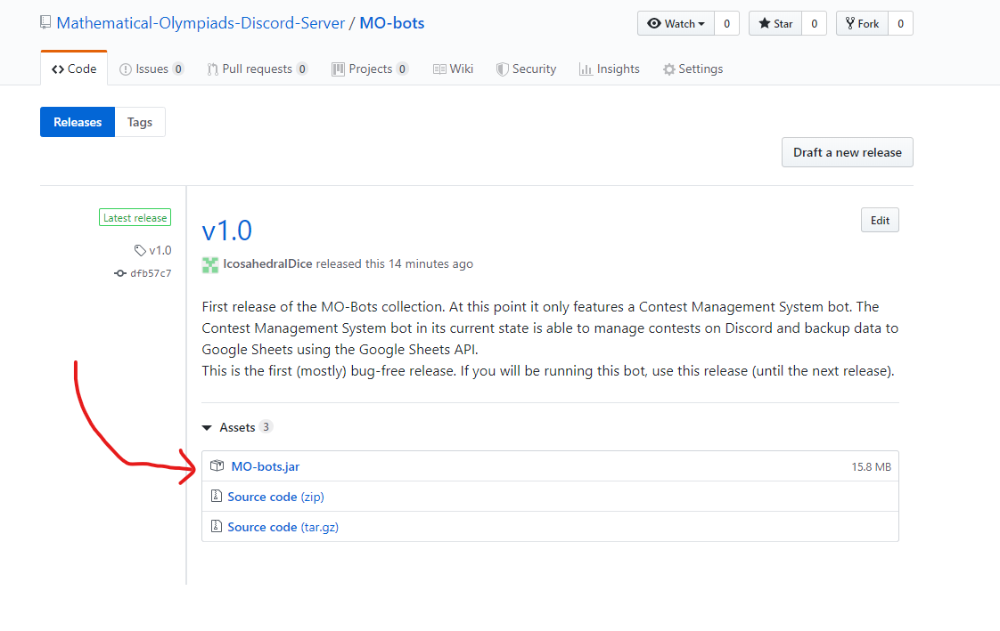

# MO-bots
These are a collection of bots made by and running on the Mathematical Olympiad Discord Server (MO Server), 
found at <https://discord.gg/94UnnAG>. Currently there is only one bot in this repository, which is the 
Contest Management System (CMS). CMS manages contests on Discord, and can keep track of contestants and timeslots
in which the contestants will be sitting the contest. CMS can also backup to Google Drive. 

## CMS Quickstart
CMS is relatively easy to get up and running. Firstly, you will need to obtain a Bot Token from Discord. There are
plenty of guides which explain how to do this.  

**Step 1:** Get the latest version of MO-bots. 

If you intend to only run the bot and not change the code, you only need the Jarfile. 

**Step 2:** Starting the bot  
Move the bot to your directory of choice, then navigate there from the command-line. Then use the following
command: `java -jar MO-bots.jar`. 

**Step 3:** API Token
The bot will request that an API Token be put in. 
  
Use the API token that you got from Discord earlier, then hit enter. The bot should then start running and should
appear as being online on Discord. 

**Step 4:** Google Sheets Integration (Optional)
If you wish to use Google Sheets integration, you will need to use the +loadcontest command in Discord. You will
then be prompted to give Google Drive access to the bot, and you will need to accept this. 

### Bot Commands and Useful Information
Bot commands can be found by using +help.  
The default command prefix is `+`. If you wish to change this, you will have to change it in the code, by going
into `src/main/java/MO/bots/MainClass.java`. On line 23 (or similar) change `cmsBuilder.setPrefix("+");` to 
`cmsBuilder.setPrefix(<new prefix>);`.  
By default, only users with the role "Staff" can access admin commands, as indicated in +help. Please make sure 
that everyone that should be able to use these commands has a role named Staff. 
